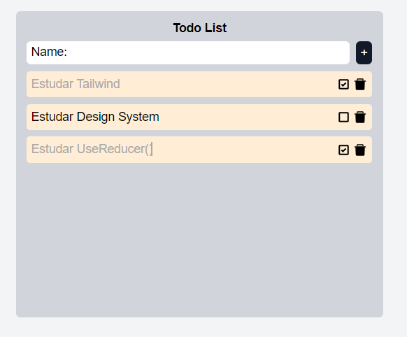

# 
 

## Descrição do projeto
Projeto simples de uma to-do list com o objetivo de aplicar o useReducer do react para criar um gerenciamento de estado das to-dos e criar diferentes actions, utilizadas por diferentes componentes, para atualização do estado global do reducer.  
Nesse projeto foi aplicado também o Tailwind, a fim de se ganhar prática na estilização utilizando esse importante framework de CSS.

## Funcionalidades
* To-do list - adicionar, completar e excluir tarefas

## Ferramentas utilizadas
* React.js
* useReducer()
* Tailwind
* React-icons

## Autores
| [ Diego Ferreira](https://github.com/diegonf) | 
| :---: |